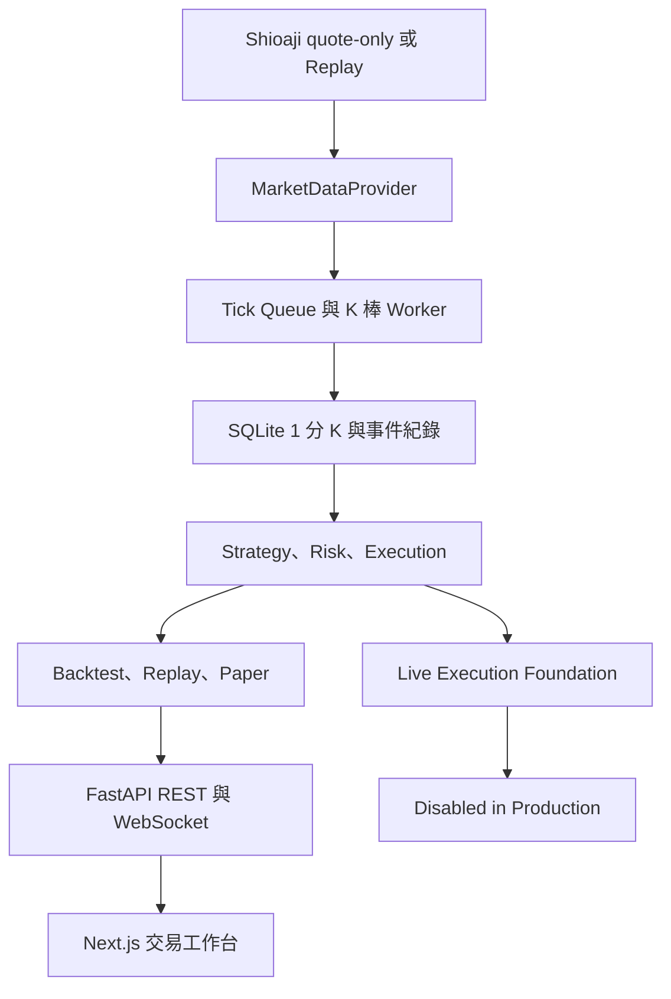
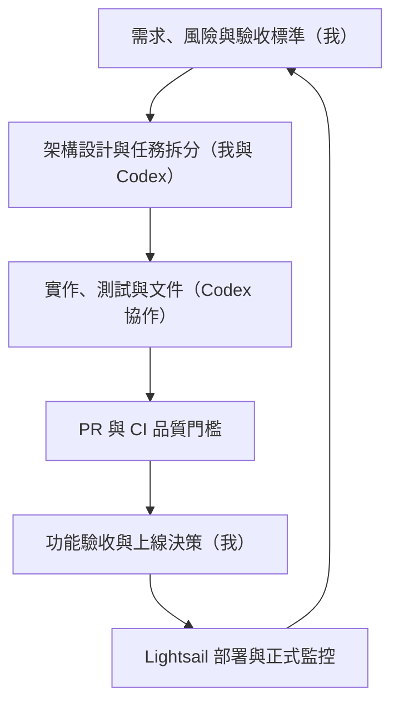

# TMF Level 2 系統化量化交易平台

[](https://github.com/3pwei/codex-tw-quant-trading-system/actions/workflows/ci.yml)

以微型臺指期貨（TMF）為核心的研究與 Paper Trading 平台，整合 Shioaji 即時行情、歷史回測、動態回放、多週期策略、事件驅動模擬成交、帳戶風控及監控。正式環境部署於 AWS Lightsail，使用 Cloudflare Access 保護入口。

> 本專案僅供研究與工程驗證，不構成投資建議。目前不會向外部券商送出真實委託。

## 核心能力

| 領域 | 已完成 |
|---|---|
| 行情 | Shioaji quote-only、Mock Replay、Tick callback → Queue → Worker、1 分 K 聚合、WebSocket |
| 週期 | `1m`、`5m`、`10m`、`15m`、`30m`、`1h`、`1d`、`1w`，共用同一份 1 分 K 資料 |
| 策略 | 14 套基本策略（含三種共用 Dow Channel 結構的進場邏輯）、多週期 Setup／Entry／Exit／Risk、ALL／ANY、三層組合策略引用 |
| 版本 | 不可變版本、參數快照、名稱唯一、封存、引用保護及回測追溯 |
| 執行 | Backtest／Replay／Paper 共用事件語意；Live foundation 提供 durable outbox、callback audit、Recovery Lock、三方對帳與 Execution Worker |
| 風控 | 帳戶與資料隔離、回測停損停利、Paper Auto managed exit、部位／每日限制、連敗冷卻、Kill Switch |
| 平台 | Cloudflare OTP、FastAPI RBAC、申請與審核、Rate Limit、Request Size Limit、稽核紀錄 |
| 穩定性 | 重啟復原、SQLite verified backup、Queue／WebSocket／DB／主機監控、五種服務狀態 |
| UI | `/trade/` 整合即時圖表與 Paper 下單；Backtest／History／Replay 提供策略 overlays、診斷副圖、參數摘要與進出場判斷脈絡；手機 Bottom Sheet |
| 部署 | Docker、Caddy、AWS Lightsail、GitHub Actions、Python 套件鎖定 |

Level 2 工程能力已實作；每個正式候選版本仍須依 [Level 2 完成標準](docs/level2-definition-of-done.md) 留存四小時 soak 與人工驗收證據。Live execution foundation 已具備可測試的 simulation 組裝邊界，但 production 固定使用 `DisabledExecutionWorker`，不載入 CA、不建立真實下單 client，也不接受 HTTP 真實委託。本平台不宣稱具備可用的實盤券商整合或 HFT 能力。

## 系統架構



- 行情 Provider 與 Broker／Order Executor 是獨立邊界；production 目前只為行情載入 Shioaji 憑證，simulation execution client 由隔離的測試組裝路徑注入。
- Tick callback 只做正規化與非阻塞入 Queue，不寫 DB、不算指標、不推送前端。
- Live、Replay、Backtest 共用 `KBar` 與策略；Backtest、Replay、Paper 共用事件、風控及成本模型。
- 行情資料全平台共用；策略、版本、回測與 Paper 資料依 `owner_user_id` 隔離。
- Live 下單基礎先持久化 order／outbox，再由 Recovery Lock 控制 dispatch；callback 只觸發 audit 與券商狀態 refresh。
- 券商 orders、fills、positions 全部一致才允許 worker 進入 ready；production 目前保持 disabled／locked。

Dow Channel 策略共用同一套 confirmed pivot、ATR、HH／HL、LH／LL 與平行軌道偵測；`Dow Channel Pullback` 在邊界測試後收回時順勢進場，`Dow Channel Reversal` 在反向突破趨勢軌道時反向進場，`Dow Channel Momentum` 則沿既有趨勢突破外側軌道。既有 key `linear_channel_breakout` 保留為 Momentum 的 canonical key，確保歷史回測、參數快照及組合策略引用持續有效。

主要程式位置：

| 路徑 | 職責 |
|---|---|
| `tw_quant/market_data/` | Provider 介面與 Shioaji／Replay Adapter |
| `tw_quant/market/` | Tick、KBar、交易時段與多週期聚合 |
| `tw_quant/strategy/` | 基本策略、參數與組合策略 |
| `tw_quant/events/` | 事件契約、虛擬時鐘與確定性事件迴圈 |
| `tw_quant/risk/` | 策略與帳戶風控 |
| `tw_quant/execution/` | 模擬成交、部位及損益帳本 |
| `tw_quant/broker/` | Broker 契約、訂單生命週期、durable outbox、callback audit、三方對帳與 Execution Worker |
| `tw_quant/live/` | FastAPI、WebSocket、監控與 SQLite Repository |
| `tw_quant/paper/`、`tw_quant/replay/` | Paper 與 Replay 交易 Session |
| `dashboard/app/` | Next.js 操作介面 |
| `deploy/lightsail/` | Caddy、Docker Compose 與部署腳本 |

## AI-native 開發流程

這個專案採用 **AI-assisted、human-governed** 的開發方式。我負責產品需求、架構決策、風險邊界、驗收標準及上線決策；Codex 協作完成程式、測試、文件與問題診斷。所有修改必須通過 PR 與自動化品質門檻，才允許部署。



每次迭代都保留需求脈絡、PR、測試結果、部署紀錄及正式環境回饋，讓 AI 產出的變更可審查、可重現、可回滾，而不是直接將生成程式碼送進正式環境。

## 主要頁面

| 路徑 | 功能 |
|---|---|
| `/` | 系統、行情與策略總覽 |
| `/trade/` | 即時行情與 Paper Trading 工作台 |
| `/backtest/` | 最長 31 天的歷史回測與可縮放交易圖表 |
| `/replay/` | 動態歷史行情與隔離模擬交易 |
| `/history/` | 回測執行紀錄、按需載入的交易圖表、績效明細與批次刪除 |
| `/strategies/` | 基本策略參數管理 |
| `/composite-strategies/` | 多週期組合策略與版本管理 |
| `/settings/` | 管理員監控與系統狀態 |
| `/admin/users/` | 帳號申請、角色及交易模式管理 |

舊 `/live/` 與 `/paper/` 會轉址至 `/trade/`，避免建立重複 WebSocket 連線。

## 快速啟動

需求：Python 3.10–3.12、Node.js 22。Python 依賴以 `uv.lock` 固定版本與雜湊。

```bash
git clone https://github.com/3pwei/codex-tw-quant-trading-system.git
cd codex-tw-quant-trading-system

python -m venv .venv
source .venv/bin/activate
python -m pip install "uv==0.11.33"
uv sync --locked --extra server --extra test

cp .env.example .env
uv run --locked --extra server uvicorn tw_quant.live.api:create_app \
  --factory --host 0.0.0.0 --port 8000 --env-file .env
```

Windows PowerShell 使用 `.venv\Scripts\Activate.ps1` 與 `Copy-Item .env.example .env`。

另一個終端啟動 Dashboard：

```bash
cd dashboard
npm ci
NEXT_PUBLIC_MARKET_API_URL=http://localhost:8000 npm run dev
```

開啟 <http://localhost:3000/>；FastAPI 文件位於 <http://localhost:8000/docs>。

Mock 模式預設重播 `data/mock_tmf_ticks.csv`，不需要券商憑證。

### Shioaji 行情

開發環境加入 Shioaji 時保留測試依賴：

```bash
uv sync --locked --extra server --extra test --extra shioaji
```

`.env` 至少設定：

```dotenv
MARKET_DATA_PROVIDER=shioaji
MARKET_CONTRACT=TMFR1
MARKET_HISTORY_DAYS=30
MARKET_HISTORY_LIMIT=50000
SJ_API_KEY=your-market-data-key
SJ_SEC_KEY=your-market-data-secret
SJ_PRODUCTION=true
```

服務只載入歷史與即時行情，不載入 CA、不啟用外部下單。個人 Shioaji 行情不代表具有多人展示或轉發授權。

## 安全與權限

正式環境使用兩層控制：

1. Cloudflare Access 以 One-time PIN 驗證 Email。
2. FastAPI 以 `app_users`、角色、權限及帳號狀態決定功能存取。

Cloudflare Policy：

- Action：`Allow`
- Include：`Everyone`
- Require：`Login Methods = One-time PIN`

任何 Email 都能驗證身分，但只有 `app_users` 中 `active` 的帳號能使用平台。未開通者可送出申請，由管理員在 `/admin/users/` 核准或拒絕。

Production 必要設定：

```dotenv
PLATFORM_ENVIRONMENT=production
MARKET_ACCESS_MODE=cloudflare
CF_ACCESS_TEAM_DOMAIN=team.cloudflareaccess.com
CF_ACCESS_AUD=replace-with-application-audience-tag
PLATFORM_AUTHORIZATION_MODE=enforced
PLATFORM_BOOTSTRAP_ADMIN_EMAILS=owner@example.com

RATE_LIMIT_ACCESS_REQUESTS_PER_HOUR=5
RATE_LIMIT_BACKTESTS_PER_MINUTE=10
RATE_LIMIT_REPLAY_PREPARES_PER_MINUTE=10
RATE_LIMIT_ORDERS_PER_MINUTE=30
API_MAX_REQUEST_BODY_BYTES=262144
```

`API_MAX_REQUEST_BODY_BYTES` 必須同時設定於 `market.env` 與 `gateway.env`。Production 若缺少 Cloudflare、enforced authorization 或 Bootstrap Admin，服務會拒絕啟動。

角色：

- `researcher`：行情、策略與回測。
- `trader`：研究功能及自己的 Paper Trading。
- `admin`：帳號、設定、監控與稽核；必須明確切換為 `paper` 才能模擬下單。

## 部署與復原

正式環境使用 Caddy + FastAPI + Next.js static dashboard，資料保存在 Docker named volume `tw-quant-lightsail_market-data` 的 `/data`。

部署有兩種觸發方式：

- PR 合併後，`master` CI 成功即自動執行 Lightsail deployment。
- `workflow_dispatch` 可指定一個屬於 `master` 的完整 commit SHA 手動部署。

部署流程會重新執行 Python 測試、Dashboard lint/build、SQLite Online Backup、容器健康檢查，以及公開 `/healthz` 的 `200 + ok` 驗證。Cloudflare 必須為 `/healthz` 設定精確的 Bypass policy。

詳細程序：

- [Level 2 正式運行與監控](docs/level2-operations.md)
- [部署驗收清單](docs/deployment-acceptance-checklist.md)
- [故障復原手冊](docs/disaster-recovery.md)
- [Paper Trading 操作手冊](docs/paper-trading-guide.md)
- [Replay Trading 操作手冊](docs/replay-trading-guide.md)
- [帳戶風控](docs/account-risk.md)
- [事件引擎](docs/event-engine.md)
- [程式架構與依賴規則](docs/architecture.md)
- [訂單生命週期與 Live 安全規則](docs/order-lifecycle.md)

## API 概覽

| 類別 | 主要端點 |
|---|---|
| 身分 | `GET /api/me`、`POST /api/access-requests` |
| 行情 | `GET /api/health`、`GET /api/kbars`、`WS /ws/market/{symbol}` |
| 策略 | `/api/strategies`、`/api/composite-strategies`、`/api/strategy-signals`、`/api/trading-runtimes`（Observe／armed Paper Auto entry 與 managed exit） |
| 回測 | `/api/backtest`、`/api/backtest-runs`；新結果包含向後相容的 `visualization.schema_version=1` 診斷資料，History detail 不重複傳送完整 points，chart endpoint 才按範圍載入；執行紀錄可逐筆勾選或批次刪除 |
| 回放 | `/api/replay/prepare`、`/api/replay/sessions/{session_id}` |
| Paper | `/api/paper/account`、`/api/paper/orders`、`/api/paper/fills`、`/api/paper/kill-switch` |
| 管理 | `/api/admin/users`、`/api/admin/access-requests`、`/api/admin/health`、`/api/admin/audit` |

## CLI 與測試

```bash
# 完整 Python 測試
uv run --locked --extra server --extra test python -m unittest discover -s tests -v

# 短版 Level 2 soak
uv run --locked --extra server --extra test python -m tw_quant level2-soak \
  --duration-seconds 60 \
  --tick-interval-seconds 0.1 \
  --output output/level2-soak.json

# 前端驗證
cd dashboard
npm ci
npm run lint
npm run build
```

其他 CLI：`demo`、`backtest`、`futures-night`、`sqlite-backup`、`sqlite-restore`。

CI 會驗證 Python 3.10／3.12、Dashboard、Docker Compose、FastAPI + Shioaji image、Caddy 及 gateway health route。`pyproject.toml` 或套件版本變更後必須更新 `uv.lock`；`uv sync --locked` 會在鎖檔不一致時失敗。

TMF 研究預設成本：契約乘數每點 NT$10、每邊手續費 NT$10、交易稅率 `0.00002`、每邊滑價 1 點。這些是可調整的研究假設，不是券商報價或成交保證。

## 已知限制與 Roadmap

目前限制：單一 TMF 商品、單機 SQLite、不含完整委託簿與實盤部分成交流程，也不處理漲跌停／暫緩撮合。外部 Broker execution foundation 已完成，但正式環境仍停用；尚未具備 production Shioaji client、CA／金鑰生命週期、原生保護委託／OCO、人工 mismatch／UNKNOWN 處理介面及完整營運解鎖流程。

下一階段優先順序：

1. 接入合法授權的歷史資料，建立 Parquet 資料層與資料品質報告。
2. 加入多標的、風險預算、walk-forward 與樣本外驗證。
3. 增加外部告警與長時間正式環境監控證據。
4. 實盤前評估 PostgreSQL，完成 Shioaji production client、CA 安全保存與輪替、完整帳戶風控、保護委託、人工覆核及法規／授權確認。
5. 資料品質與研究流程成熟後，再評估 Regime Detection、Feature Store 與 ML 策略。
