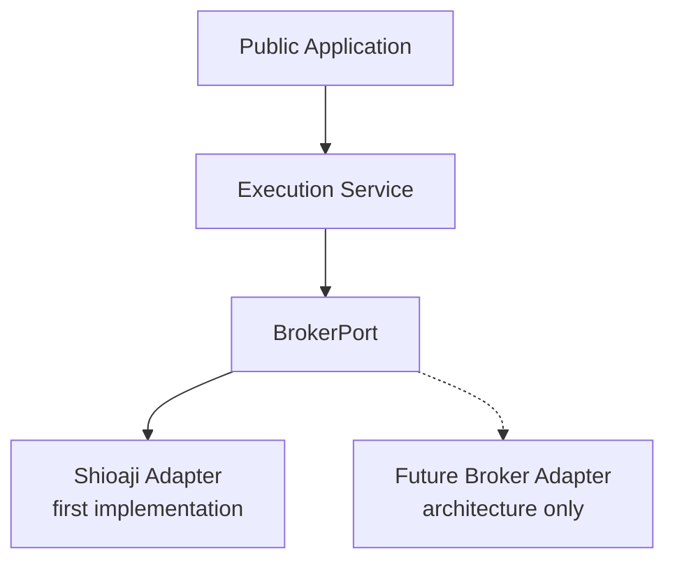
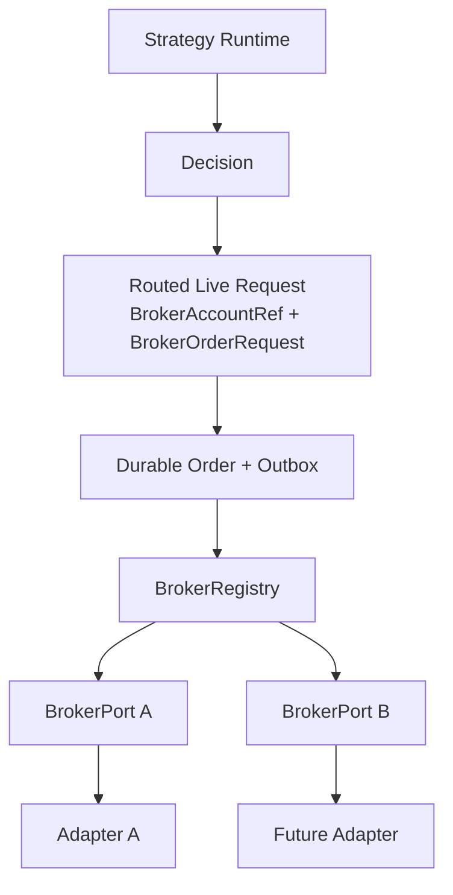
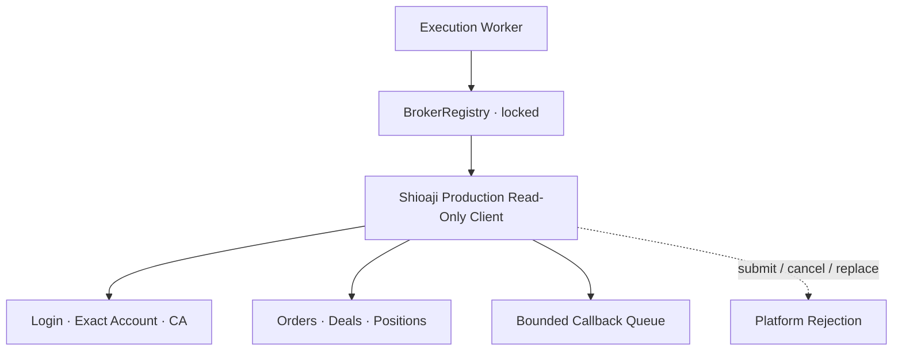
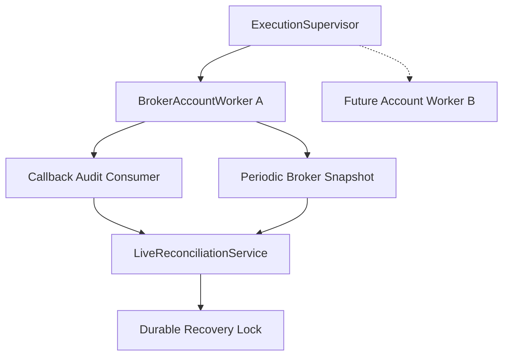
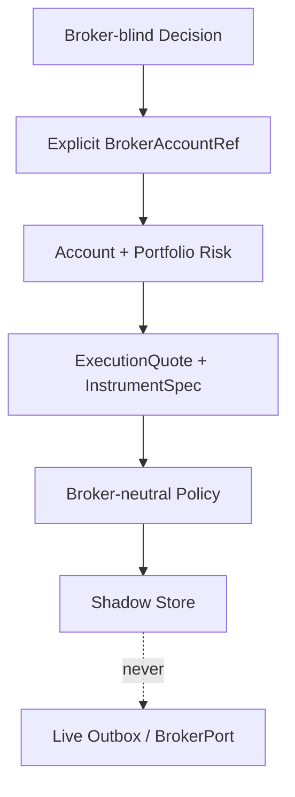

# 程式架構與依賴規則

本文件是新進維護者理解系統的入口。現階段平台提供行情、策略研究、歷史回測、
Replay 與 Paper Trading；真實券商下單尚未啟用。架構調整採漸進式遷移，既有 API
在替代實作完成前不得直接移除。

## 執行路徑

| 路徑 | 入口 | 執行方式 | 外部券商 |
|---|---|---|---|
| 歷史回測 | `tw_quant.backtest.runner` | 先產生策略訊號，再重建事件與模擬成交 | 不會連線 |
| 即時策略 | `GET /api/strategy-signals` | 重新分析目前 K 棒並回傳訊號 | 不會送單 |
| Strategy Runtime | `/api/trading-runtimes` | closed K 保存 Decision；armed `paper_auto` 管理 Paper entry／exit | 不會連接真實券商 |
| Replay | `/api/replay/sessions/*` | 隔離帳戶中的手動模擬市價單 | 不會連線 |
| Paper | `POST /api/paper/orders` | 帳戶風控後，以伺服器行情模擬成交 | 不會連線 |
| Shioaji Simulation | `ShioajiSimulationExecutionClient` | SDK 整合測試，尚未接 API／Worker | 模擬環境限定 |
| Live read-only | execution worker + `BrokerRegistry` | Shioaji production account truth；per-account recovery | 只讀連線可明確啟用，寫入停用 |
| Live Shadow | closed-bar Strategy Runtime | Live Risk + Execution Policy → shadow audit | 不呼叫 BrokerPort，不建立 live outbox |

Strategy Runtime 提供 Observe Mode，以及預設 paused、必須明確 armed 的 Paper Auto
Mode。Paper Auto entry 由 closed-bar durable Decision 經 market/account/permission/
recovery/kill-switch gate 與 `AccountRiskGate` 後建立 `next_bar_open` OrderIntent。實際
entry fill 會依 immutable strategy snapshot 建立 server-owned SL／TP；closed K 的
canonical strategy exit 於 next open 成交，SL／TP 則以保守的 bar-trigger policy
處理，同棒歧義固定由 stop loss 優先。所有 exit 都是 reduce-only，且只經既有
simulated broker，不依賴或建構真實券商 client。

服務重啟會把先前 armed 的 Paper Auto Runtime 持久化切換為
`recovery_locked`。核對 runtime snapshot、decision、order、fill、position 與
protective levels 後仍需使用者重新 arm；恢復中的舊 entry 會以
`stale_or_recovered_signal` 終止，但 reduce-only protection 保持可用。下一根開盤
Fill 前會再以 executable open（含滑價）與 preliminary stop 執行 gap-risk recheck。

## 現有模組責任

| 模組 | 責任 | 不應負責 |
|---|---|---|
| `market_data` | 外部行情 Provider 與正規化 | 策略、風控、下單 |
| `market` | Tick、KBar、時段與週期 | 券商 SDK |
| `strategy` | 由標準 KBar 產生策略意圖與圖層 | 帳戶風控、券商送單 |
| `events` | 穩定事件契約與確定性事件迴圈 | 交易策略 |
| `risk` | 策略風險價格與帳戶風控決策 | 模擬成交、部位猜測 |
| `execution` | 訊號執行政策、模擬成交與 Position Ledger | HTTP、使用者介面 |
| `paper` | Paper use case、BrokerPort adapter、持久化與復原 | 真實券商送單 |
| `broker` | 訂單契約、生命週期、durable outbox、Broker port 與 adapter | 行情供應、策略規則 |
| `live` | API、WebSocket、組裝服務與監控 | 交易領域規則 |
| `execution_service` | 隔離 process composition、secret/CA、production read-only lifecycle、locked health | HTTP、策略、production SDK submit/cancel |

## Live Execution Security Boundary

Public Application 與 Execution Service 是不同 process/container。前者不取得 live
broker credentials 或 CA，也不建構任何 production broker client。後者無 HTTP
port、Caddy route 或 browser endpoint，並透過既有 SQLite live outbox/recovery 邊界與
application 解耦。預設仍組裝 `DisabledExecutionWorker`；明確啟用 read-only connection
時則註冊 Shioaji adapter 讀取 broker truth，但 registration 與 admission gate 保持
locked，client 也拒絕 submit/cancel/replace，因此真實委託仍為零。

### Broker-neutral Execution Boundary



Execution connection 以 `BrokerConnectionSettings` 表達
`connection_id / broker_name / account_id / enabled / secret_ref`，其中 secret ref
是不透明參照。安全、Recovery、log 與 health 的 canonical identity 都是
`BrokerAccountRef(broker_name, account_id)`；不能只以 account ID 辨識。券商專屬 env
名稱與憑證驗證位於 adapter-side `BrokerSecretProvider`，不進入 execution application
core。現階段只在 composition/factory layer 驗證 `disabled` 與 `shioaji`，沒有宣稱已
支援第二家 production 券商。

詳細 secret ownership、network isolation、fail-closed 狀態與部署遷移見
[Live Execution Security Boundary](live-execution-security-boundary.md)。

### Multi-Broker Execution Architecture



`BrokerOrderRequest` 保持 Paper／Replay 相容，不包含 broker routing。Live execution
使用 `RoutedBrokerOrderRequest` envelope，並把 `broker_name + account_id`
同時寫入 `live_orders` 與 `live_order_outbox`。Worker restart 後只能依 durable
target dispatch；不會讀取當下 default broker，也不會在 target unavailable 時改送
其他 account。

`BrokerRegistry` 與 adapter factory 是兩個不同責任：

- factory 根據 composition layer 已註冊的 builder 建立 adapter registration；
- registry 保存已建立、長生命週期的 account runtime，以 `BrokerAccountRef`
  dictionary key 做 O(1) 精確解析；
- duplicate registration、unknown target、locked/unavailable runtime 全部 fail closed；
- registry 組裝完成後 freeze，不支援執行中 unregister。

每個 `BrokerRegistration` 只保存 account ref、`BrokerPort`、
`BrokerCapabilities`、`BrokerInstrumentMapper` 與 runtime state。Capabilities
只供 Execution Policy 判斷 adapter 能力，Strategy 不得讀取。Instrument mapper
負責 canonical symbol/contract 與券商 identifier 的轉換；mapping failure 不得使用
原字串猜測或 fallback。

新增券商的標準流程：

1. 實作 `BrokerPort` adapter。
2. 實作該 connection 的 credential provider。
3. 實作 `BrokerInstrumentMapper`。
4. 宣告 `BrokerCapabilities`。
5. 通過共用 BrokerPort contract tests。
6. 在 adapter factory／execution composition 註冊 builder。

新增券商不應修改 Strategy Runtime、`LiveOrderManager` 或核心 Risk logic。
目前 fake A/B 只用於 contract 與 routing tests；production 沒有第二家券商，也沒有
真實 submit path。

### Shioaji Production Read-Only Adapter



`ShioajiProductionExecutionClient` 與 simulation client 完全分離，並明確以
`Shioaji(simulation=False)` 建立 SDK instance。啟動依序載入該 connection 的 secret、
精確比對 allowlisted futures account、啟用 CA、註冊 callback，成功後只進入
`read_only_ready`。沒有使用 `accounts[0]`、`futopt_account` 或其他 account fallback。

所有 blocking SDK calls 經同一個 `asyncio.Lock` 與 `asyncio.to_thread` 序列化，一個
API instance 只有一個 logical owner。Market Data 的 Shioaji instance 不會共用。
reconciliation snapshot 在同一 serialized operation 依序 update status、讀取 trades 與
positions；未知 status、instrument、deal identity、position direction 或 account mismatch
都以穩定 code fail closed，不以 local order 補齊 broker snapshot。
`LIVE_BROKER_INSTRUMENT_MAP_JSON` 明確列出 canonical symbol/contract 與 Shioaji code；
read-only connection 缺少 mapping 時不登入，未知 code 也不做 identity fallback。

SDK callback hot path 只抽取 allowlisted 最小欄位、驗證 `BrokerAccountRef`、計算穩定
event ID 並用 `put_nowait` 投遞 bounded queue。它不寫 DB、不執行策略／risk、不呼叫
SDK；queue full 只增加 dropped/degraded 指標，後續 periodic reconciliation 才是復原來源。
health 使用 cached connection state，不因查詢 health 而呼叫券商。

### Live Recovery and Reconciliation Runtime



每個 worker 只持有一個 `BrokerAccountRef`、client、bounded callback queue、consumer、
reconciliation service、Recovery Lock 與 cached health。不同帳戶可並行，但同一帳戶以
async lock 保證最多一輪 reconciliation。Worker 不含 dispatch task；Registry 的
`READY` 只表示 adapter 可供 read/refresh，永久 `LockedOrderAdmissionGate` 與 read-only
client 仍拒絕所有寫入。

啟動順序固定為 `STARTING → LOCKED → BROKER_CONNECTING →
BROKER_READ_ONLY_READY → RECONCILING → READY_READ_ONLY`。第一個可觀察 side effect 是
持久化新的 locked generation，因此 process restart 不會沿用舊 READY。timeout、斷線、
callback overflow、未知 callback、stale snapshot 或任何 reconciliation issue 都會寫入
新的 locked generation，使較舊的晚到結果無法解鎖。

Public FastAPI 不載入 broker SDK 或 credential；它只從 read-only named volume 讀取
execution worker 原子寫入的 health JSON，並再次 allowlist 欄位。`/settings/` 因此不會
觸發 broker I/O。

### Live Risk and Shadow Execution



`LiveRiskConfig` 是 server-owned、具內容 hash version 的獨立模型，不沿用 Paper
`AccountRiskConfig`。Risk 只讀 cached execution health、durable recovery state、最新
broker reconciliation snapshot 與 live order ledger；不知道 Shioaji SDK。Owner 所有
已授權 opaque target 都納入 canonical position aggregation，因此相同商品跨券商曝險會
合併，同一帳戶 limit 仍獨立。任何 stale／unknown truth 都拒絕新增曝險。

Shioaji quote-only adapter 的 Tick 與 BidAsk callback 分開；BidAsk 只正規化成
`ExecutionQuote` 並更新 O(1) memory cache，缺 bid/ask 時絕不以 last price 偽造。
`MarketableLimitIOCPolicy` 使用 `InstrumentSpec.tick_size`、spread/slippage limits 與
target-specific capabilities；不支援 IOC/limit 時拒絕，沒有 order-type fallback。

Shadow sink 與 live sink 在型別及 composition 上分離。`ShadowExecutionService` 以
owner single-writer lock 加 durable short-lived reservation，避免兩個 Runtime 同時讀到
舊曝險而都通過。結果與 reservation 存入獨立 shadow tables；runtime stop 清除
reservation，schema 沒有 live outbox 外鍵或 trigger。Public target allowlist 只保存
不可逆 `target_id`，不在 market-api env 複製 broker account ID 或 credentials。

Kill Switch 使用 `global / owner / broker_account` scope 及 `HALT_ENTRY /
CANCEL_WORKING / FLATTEN` action。本 PR 只做 Shadow 語意與 audit；不送撤單或平倉指令。

## 依賴方向

核心事件與交易模型不得 import FastAPI、SQLite、Dashboard 或 Shioaji。外部 adapter
可以依賴核心 port，核心不能反向依賴 adapter。行情帳戶與交易帳戶維持分離。

```text
Interfaces (API / Worker)
  → Application services
    → Domain events and policies
      ← Ports
        ← Paper / SQLite / Shioaji adapters
```

FastAPI 的 `create_app()` 只負責 dependency wiring、lifespan 與 middleware；HTTP
端點依 system、admin、paper、market、strategy、research 分組於 `live/api_routes/`。
Router 透過 `ApiDependencies` 取得服務，不直接建立資料庫、行情 provider 或交易元件。
Paper、策略管理、Replay 與回測流程集中於 `live/application/`；application service
不依賴 FastAPI，router 只負責 schema、使用者身分與 HTTP error 轉換。應用層錯誤統一
由 `live/api_errors.py` 映射，避免狀態碼判斷散落於各 use case。

SQLite 仍可由單一 `SQLiteBarRepository` adapter 管理同一資料庫，但應用層不得依賴
包含全部 persistence 能力的介面。`MarketRepository` 只提供 K 棒與 Tick 去重；
`StrategyRepository` 只提供策略參數及組合策略；`BacktestRepository` 只提供回測結果；
`TradingRuntimeRepository` 只提供 Runtime、Decision 與原子 cursor 更新。
只有 `create_app()` composition root 可使用整合三者的 `ApplicationRepository`。
`BarRepository` 暫時保留為相容 alias，新程式不得再以它宣告 application dependency。

Dashboard 的頁面元件只負責畫面組合與使用者操作。共用 HTTP base URL、response
解析與 JSON request 建立集中於 `dashboard/app/lib/api-client.ts`；價格、金額與台北
時間格式集中於 `dashboard/app/lib/formatters.ts`。Live 的行情 WebSocket、K 線圖與
Paper overlay 分別由專用 hook 管理；Paper 帳戶輪詢及 Replay 圖表生命週期也不得
重新放回頁面元件。hook 可以依賴 API client 與純型別，不能直接依賴其他頁面的 UI。

策略分析結果可附加 `visualization.schema_version=1`。此契約以 `overlays`、
`diagnostics`、`panels` 與 `parameters` 描述圖層，所有 series 具有穩定的 key、label、
panel、type、timestamp points 與可選 metadata。指標在策略分析時一次計算；Backtest
直接保存，History chart endpoint 只依可見時間範圍裁切，Replay 則依游標顯示既有
points，不在 React render 階段重算。舊 `overlays` 欄位保留給既有 Dow Channel 結果，
沒有 `visualization` 的歷史紀錄仍顯示 K 棒、成交量與進出場點。
`GET /api/backtest-runs/{run_id}` 不回傳完整 visualization，避免 History detail 與 chart
重複下載 diagnostics；不可變的完整快照仍保存在 `result_json`，只由 chart endpoint 依
交易可視範圍取用。Dashboard 的通用 series preparation 會依
`point.group ?? series.key` 拆分獨立圖層，並由 Backtest 與 Replay 共用 threshold 端點
規則。next-open entry 同時保存訊號確認的 `trigger_time` 與實際成交的 `entry_time`，
其中 diagnostic context 固定屬於 `trigger_time`。
Paper／Replay 的共用資料契約分別位於功能目錄的 `types.ts`；page component 與 hook
只能共同依賴型別檔，hook 不得反向 import page component。WebSocket 重連與 stale
watchdog、Paper 帳戶載入、Replay 游標與圖表事件可見性必須通過 Dashboard 行為測試。

新增 Live Execution 時沿用以下責任邊界：

1. Strategy Runner 只消費已收盤 K 棒；Observe Mode 僅保存具冪等 ID 的
   `TradingDecision`，未來 execution mode 才可經明確風控產生 `SignalEvent`。
2. `LiveOrderManager.create()` 先經 `CompositeOrderAdmissionGate`（Recovery Lock、
   Live Trading Safety、future Risk／ARM／Kill Switch）後，才將核准委託與 outbox
   原子寫入，再交給 `BrokerPort`。
3. Risk Gate 只能核准、縮減或拒絕，不得自行建立成交。
4. Broker Adapter 只轉換請求與回報，不包含策略規則。
5. Position Ledger 只根據 `FillEvent` 改變持倉。
6. Reconciliation Service 以券商委託、成交與部位為 Live 真實來源。

`broker` 內部依賴方向為：

```text
BrokerOrderRequest / BrokerOrderStatus
  → lifecycle policy
  → LiveOrderManager → SQLiteLiveOrderRepository
                     → BrokerPort → broker adapter
                                  → ShioajiBrokerAdapter → normalized SDK client
  → LiveReconciliationService → RecoveryLockStore
                              → BrokerReconciliationSource
```

`ShioajiSimulationExecutionClient` 是獨立於行情 provider 的 simulation-only SDK
adapter。它把阻塞 SDK 呼叫移到 worker thread，集中正規化 Shioaji 委託狀態與成交
均價；callback edge 只驗證並 enqueue。`BrokerCallbackConsumer` 先把 callback 寫入
獨立 audit store，再透過 `LiveOrderManager` 查詢券商真實狀態；audit repository、
order repository 與 SDK adapter 都依賴 protocol，不互相反向 import。

callback 內容是喚醒 reconciliation 的提示，不是訂單與部位的真實來源。consumer
只能 refresh 已有 `broker_order_id` 的本地委託；找不到配對時留下 audit 狀態，不得
推測 client order ID 或送出替代委託。

`LiveReconciliationService` 比較本地訂單、券商 orders/deals 與券商 positions。
`RecoveryOrderGate` 同時保護 order reservation 與 outbox dispatch；只有持久化
Recovery Lock 為 `ready` 才能通過。對帳失敗只回報 issue code，不會自行建立成交、
調整 Position Ledger、撤單或平倉。

`ShioajiBrokerAdapter` 不得直接由 HTTP handler 建立。Production read-only client
由 execution service composition 建立；仍需外部告警與人工營運解鎖流程。
Production client 是明確的新組裝路徑，simulation client
永遠不接受 `simulation=False`。

`BrokerAccountWorker` 統一管理啟動對帳、callback audit consumer、定期三方對帳及
heartbeat，但刻意沒有 durable outbox dispatch task。啟動時 Recovery Lock 未達
`ready`，或任一輪對帳失敗，worker 都保持 locked；callback queue 必須有界且
overflow／處理失敗需出現在監控。
`build_execution_runtime()` 只接受外部已建立的 BrokerPort 與 reconciliation source，
本身不得讀取憑證、載入 CA 或建立 SDK client。Production composition 預設掛載
`DisabledExecutionWorker`；明確啟用 read-only 時改由 `ExecutionSupervisor` 擁有 account
worker。健康資訊顯示 disabled/locked/ready_read_only/degraded、ordering 固定 disabled，
external submit/cancel calls 固定為 0。

Paper HTTP handler 使用 `BrokerOrderRequest` 呼叫 `PaperTradingService.submit_request()`；
service 保留帳戶風控與事件持久化責任，`PaperBrokerAdapter` 則提供相同的 `BrokerPort`
給非 HTTP 呼叫端。相容用的 `PaperOrderCommand` 在 Replay 完成遷移前不得移除。

Paper 的 `paper_events` 仍是不可變的事實來源；同一個 SQLite transaction 會同步更新
orders、fills、positions read model 與 projection checkpoint。帳戶查詢、冪等重送及
Broker refresh 只能使用具 owner index 的 read model，不得反覆掃描完整事件紀錄。
既有資料在 migration 時按 sequence 增量重建 projection；啟動 recovery 仍獨立重播
事件並核對風控與持倉，projection 不得取代 fail-closed 的一致性驗證。

## 相容與淘汰原則

- `linear_channel_breakout` 是 Dow Channel Momentum 的 canonical 相容 key，歷史 snapshot、
  已存參數與 Composite 規則均不得改寫。Pullback、Reversal 與 Momentum 共用
  `detect_linear_channels()`；不得複製 pivot、ATR 或 channel detector。
- Dow Channel 的 `invalidation_bars` 只決定 detector 何時正式移除軌道，不能隱性代表
  reversal position exit。Pullback／Momentum 可在正式失效事件後 next-open 出場；
  Reversal 本身由反向突破進場，只使用共用停損／停利，避免被同一突破立刻平倉。
- `tw_quant.engine.BacktestEngine` 是較早期的日內股票回測路徑；新 TMF 功能不得再
  增加對它的依賴。
- `execution.simulator` 負責策略層的 next-open 研究語意；
  `execution.event_simulator` 負責事件、成交成本與持倉。不得再新增第三套成交核心。
- `execution.position_ledger` 是持倉與已實現交易的唯一帳本；只接受 `FillEvent`，
  不得依賴 API、資料庫或券商 adapter。`event_simulator` 暫時 re-export 舊名稱以維持
  import 相容。
- `execution.signal_router` 將策略訊號轉成 position-aware `OrderIntent`；
  `risk_gates` 只決定核准與否；`simulated_broker` 只處理確定性模擬成交；
  `liquidator` 只建立時段與換月減倉意圖；`pipeline` 是唯一組裝位置。
- `execution.event_simulator` 已收斂為相容 facade，新程式不得再把實作加入該檔案。
- 移除舊介面前，必須先建立相容 adapter、遷移測試與 ADR。

## Pull Request 驗收

交易相關 PR 必須同時滿足：

- 公開函式與事件具明確型別，拒絕原因使用集中定義的穩定代碼。
- Domain／policy 不依賴 framework 或外部 SDK。
- Paper 與未來 Live adapter 通過相同 contract tests。
- 新設定集中於 config，不在 handler 或 UI 散落魔法數字。
- 行為變更包含單元測試、事件整合測試與失敗路徑。
- 更新本文件、`order-lifecycle.md` 或對應操作手冊。
