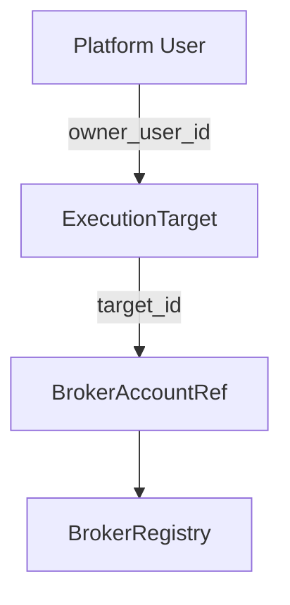

# Execution Targets

## Production canonical path (PR #120)

Production resolves exactly `LIVE_EXECUTION_OWNER_USER_ID + LIVE_EXECUTION_TARGET_ID`.
The worker calls `ExecutionTargetRepository.get_owned()`, obtains the immutable
`BrokerAccountRef` and `secret_ref`, resolves only that target's secret directory,
and registers that exact account in `BrokerRegistry`. Unknown or inactive targets,
owner/account mismatch, absent secrets, unavailable brokers, and more than one
active production target all fail closed. Legacy account environment variables
are not a routing fallback.

Live Auto persists opaque `execution_target_id` plus the broker/account snapshot.
ARM and dispatch revalidate all three, so an existing runtime cannot be retargeted.

## Purpose

`ExecutionTarget` separates platform ownership from the broker's exact execution identity:

| Component | Owns | Does not own |
|---|---|---|
| `ExecutionTarget` | identity, owner, routing metadata, status, opaque `secret_ref` | credentials, strategies, PnL, orders, positions, Recovery, Guardian |
| Secret Resolver | resolve exact per-target credential material inside execution service | target authorization or broker routing |
| `BrokerRegistry` | active in-process broker runtime and capabilities | durable ownership or credentials |
| Live Order | durable exact `BrokerAccountRef` truth | target ownership metadata |

## Identity and authorization

`target_id` is a stable opaque `exec_...` identifier and never embeds account number, email, or
secret data. Every target has exactly one `owner_user_id`. Owner-scoped calls use the authenticated
server identity and `get_owned(owner_user_id, target_id)`; a browser owner field is never trusted.

The durable repository uniquely constrains both `target_id` and `(broker_name, account_id)`.
Resolution of an active owned target produces the existing canonical `BrokerAccountRef`. Unknown,
cross-owner, duplicate, disabled, locked, unavailable, or broker-mismatched targets fail closed.
There is no default-account, first-account, or alternate-broker fallback.

## Status

- `active`: eligible for later execution composition. It does not mean ARMED or live-enabled.
- `disabled`: blocks creation of a new execution runtime.
- `locked`: temporarily blocked for security, recovery, or administration.

ARM state, Recovery state, Kill Switch state, and production acceptance remain in their existing
subsystems.

## Persistence and migration

SQLite creates `execution_targets` and `execution_target_schema_migrations` additively. Migration
version 1 is idempotent and does not alter Live Order, outbox, Recovery, broker truth, or Guardian
tables. Restarts can safely rerun it.

Legacy account variables are accepted only by the explicit migration command. Normal service
startup never bootstraps a target. The command requires exactly one owner and broker/account,
is deterministic and idempotent, and never connects to the broker, changes acceptance, or arms.

## Current rollout boundary

Production restricts eligible active targets to one and requires its exact
`file:broker-secrets/<target_id>` directory. Legacy environment secrets are rejected by production
startup. Multiple live broker clients, onboarding UI, Canary activation,
and Strategy Auto activation remain later work. The defaults remain `LIVE_CANARY_ENABLED=false`, `LIVE_AUTO_ENABLED=false`, and
`LIVE_AUTO_PRODUCTION_ACCEPTANCE_PASSED=false`.
