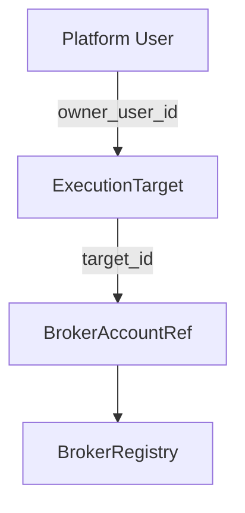

# Execution Targets

## Purpose

`ExecutionTarget` separates platform ownership from the broker's exact execution identity:

| Component | Owns | Does not own |
|---|---|---|
| `ExecutionTarget` | identity, owner, routing metadata, status, opaque `secret_ref` | credentials, strategies, PnL, orders, positions, Recovery, Guardian |
| Secret Resolver (future PR) | resolve per-target credential material inside execution service | target authorization or broker routing |
| `BrokerRegistry` | active in-process broker runtime and capabilities | durable ownership or credentials |
| Live Order | durable exact `BrokerAccountRef` truth | target ownership metadata |

## Identity and authorization

`target_id` is a stable opaque `exec_...` identifier and never embeds account number, email, or
secret data. Every target has exactly one `owner_user_id`. Owner-scoped calls use the authenticated
server identity and `get_owned(owner_user_id, target_id)`; a browser owner field is never trusted.

The durable repository uniquely constrains both `target_id` and `(broker_name, account_id)`.
Resolution of an active owned target produces the existing canonical `BrokerAccountRef`. Unknown,
cross-owner, duplicate, disabled, locked, unavailable, or broker-mismatched targets fail closed.
There is no default-account, first-account, or alternate-broker fallback.

## Status

- `active`: eligible for later execution composition. It does not mean ARMED or live-enabled.
- `disabled`: blocks creation of a new execution runtime.
- `locked`: temporarily blocked for security, recovery, or administration.

ARM state, Recovery state, Kill Switch state, and production acceptance remain in their existing
subsystems.

## Persistence and migration

SQLite creates `execution_targets` and `execution_target_schema_migrations` additively. Migration
version 1 is idempotent and does not alter Live Order, outbox, Recovery, broker truth, or Guardian
tables. Restarts can safely rerun it.

Legacy `LIVE_BROKER_ACCOUNT_ID`, `LIVE_ALLOWED_ACCOUNT_IDS`,
`LIVE_CANARY_ALLOWED_OWNER_IDS`, and `LIVE_BROKER_SECRET_REF` remain compatible bootstrap inputs.
Bootstrap occurs only when exactly one owner and one broker/account identity are known; it is
deterministic and idempotent. Missing or ambiguous ownership and owner changes fail closed. It
never resolves credentials, enables broker writes, changes acceptance, or arms a runtime.

## Current rollout boundary

Production may still restrict active targets to one. Per-target secret resolution, multiple live
broker clients, account onboarding UI, Canary activation, and Strategy Auto activation are later
work. The defaults remain `LIVE_CANARY_ENABLED=false`, `LIVE_AUTO_ENABLED=false`, and
`LIVE_AUTO_PRODUCTION_ACCEPTANCE_PASSED=false`.
