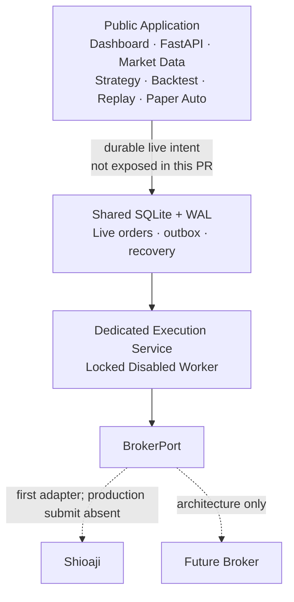

# Live Execution Security Boundary

Production real order execution is still disabled. This boundary separates the
public application from future broker credentials and execution I/O; it does not
authorize, expose, or implement a real-order workflow.

## Process boundary

The `execution-worker` container has no HTTP server, host port, Compose
`expose`, Caddy route, Cloudflare route, or browser endpoint. It runs on an
internal-only Docker network in this phase, so it also has no external broker
network path. Market tick callbacks and FastAPI's event loop do not run this
process or its future SDK I/O.

## Secret ownership

| Value | market-api | dashboard/gateway | execution-worker |
|---|---:|---:|---:|
| `MARKET_SJ_API_KEY` / `MARKET_SJ_SECRET_KEY` | quote-only | no | no |
| `SJ_API_KEY` / `SJ_SECRET_KEY` | no | no | live-only env file |
| connection ID, broker, account / allowlist | no | no | live-only env file |
| `SJ_CA_CERT_PATH` / `SJ_CA_PASSWORD` | no | no | Shioaji provider + read-only mount |

Real values stay under `/opt/tw-quant/config/execution.env` (mode `0600`) and
`/opt/tw-quant/secrets` on the host. They are excluded from Git and Docker build
contexts. The CA file must be a non-symlink regular file with no group or other
permission bits. Missing values, an unavailable CA, open CA permissions, or an
account outside `LIVE_ALLOWED_ACCOUNT_IDS` keeps the service locked.

## Broker-neutral connection and secret boundary

The execution application identifies every connection by `connection_id` and
every recovery/security subject by immutable `(broker_name, account_id)`.
`BrokerConnectionSettings` contains only non-secret metadata: broker name,
account ID, enabled state and an opaque `secret_ref`. Broker names are strings;
the core does not carry an enum that must change for every new adapter.

The application depends on `BrokerSecretProvider`, which resolves secret
material for one complete connection identity. Environment variable names,
certificate rules and future SDK credential types belong to the broker adapter
layer. The first provider understands Shioaji's `SJ_*` variables; the execution
application does not. The temporary `CA_CERT_PATH` / `CA_PASSWORD` names from
the first local revision remain accepted as compatibility aliases, while new
configuration uses `SJ_CA_CERT_PATH` / `SJ_CA_PASSWORD`.

This release composes one connection only. The health collection model can
represent more than one connection, but BrokerRegistry, routing, capabilities,
multi-account scheduling and a second adapter are explicitly deferred.

Account IDs are serialized as `****1234`. API keys, secret keys, CA passwords,
full CA paths, raw login payloads, and full account credentials must never be
returned, logged, or forwarded to the browser. The general log filter redacts
known secret values before a record is emitted.

## Admission and execution state

`LiveOrderManager.create()` is the sole durable reservation entry. A
`CompositeOrderAdmissionGate` runs, in order:

1. persistent Recovery Lock;
2. broker-neutral account safety (enabled, explicit confirmation and
   broker/account allowlist);
3. `LockedOrderAdmissionGate`.

The final gate is deliberate for this release. Therefore even a complete
configuration with `BROKER_PROVIDER=shioaji` and `LIVE_TRADING_ENABLED=true`
produces zero external order calls. The composition root uses
`DisabledBroker` and `DisabledExecutionWorker`; it does not construct a
production Shioaji client.

Live activation will require a separate reviewed PR to replace only the final
gate and disabled adapter after Live Risk, ARM/Kill Switch, protective-order,
real reconciliation, callback, alerting, and operational acceptance work is
complete. `role=admin` is never an activation condition.

## Persistence boundary

SQLite + WAL remains suitable for the current single-node deployment and
`LiveOrderStore` remains replaceable. Existing tables are reused:

- Live: `live_orders`, `live_order_outbox`, `live_broker_events`,
  `live_recovery_lock`.
- Paper: `paper_events`, `paper_order_read_model`, `paper_fill_read_model`,
  `paper_position_read_model`.

No Paper order, fill, position, ID space, or recovery state is reused for Live.
`live_recovery_lock` already uses `(broker_name, account_id)` as its composite
primary key, so identical account IDs at different brokers remain independent.
Order/outbox routing identity is deferred with Multi-Broker Dispatch and is not
invented in this security-boundary PR.
Durable Live fill and position projections remain future work with real account
and callback integration; this PR does not invent them or infer broker state.

## Fail-closed outcomes

The service is `disabled` when the provider or feature flag is disabled and
`locked` for unknown provider, missing/invalid secrets, bad confirmation,
non-allowlisted account, invalid configuration, Recovery Lock, or the permanent
`production_submit_not_implemented` gate. Locked is a healthy process state:
container health proves the isolated process is alive, not that ordering is
enabled.

## Deployment and migration

1. Copy `execution.env.example` to
   `/opt/tw-quant/config/execution.env`, mode `0600`.
2. Create `/opt/tw-quant/secrets`, owned by the deployment administrator. Do
   not place a CA there for this disabled phase.
3. Migrate quote credentials in `market.env` from legacy `SJ_API_KEY` /
   `SJ_SEC_KEY` to `MARKET_SJ_API_KEY` / `MARKET_SJ_SECRET_KEY`.
4. Keep `BROKER_PROVIDER=disabled` and `LIVE_TRADING_ENABLED=false`.
5. Deployment builds both image targets, validates the locked execution config,
   starts the worker, checks container health, and rejects any published port.

Rollback removes the `execution-worker` service and restores the previous
revision. Existing SQLite tables are additive and require no data migration or
down migration.
