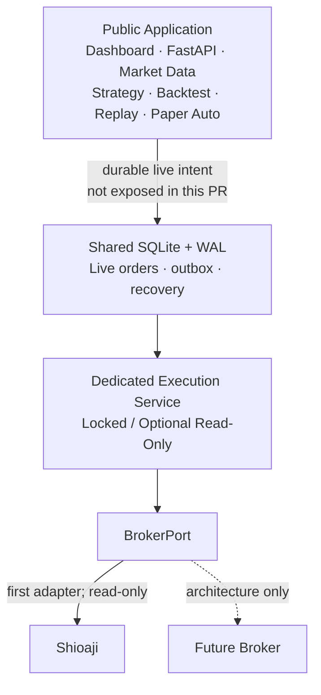

# Live Execution Security Boundary

Production real order execution is still disabled. This boundary separates the
public application from broker credentials and execution I/O. The isolated worker
may establish an explicitly enabled Shioaji production read-only connection, but
it does not authorize or expose a real-order workflow.

## Process boundary



The `execution-worker` container has no HTTP server, host port, Compose
`expose`, Caddy route, Cloudflare route, or browser endpoint. It runs on an
dedicated Docker network not shared with gateway or market-api. That network permits
outbound broker TLS required for read-only login but provides no inbound/public
route. Market tick callbacks and FastAPI's event loop do not run this process or
its SDK I/O.

## Secret ownership

| Value | market-api | dashboard/gateway | execution-worker |
|---|---:|---:|---:|
| `MARKET_SJ_API_KEY` / `MARKET_SJ_SECRET_KEY` | quote-only | no | no |
| `SJ_API_KEY` / `SJ_SECRET_KEY` | no | no | live-only env file |
| connection ID, broker, account / allowlist | no | no | live-only env file |
| `SJ_CA_CERT_PATH` / `SJ_CA_PASSWORD` | no | no | Shioaji provider + read-only mount |

Legacy environment values stay under `/opt/tw-quant/config/execution.env` (mode `0600`).
Per-target values stay under `/opt/tw-quant/secrets/brokers/<target_id>` on the host.
They are excluded from Git and Docker build
contexts. The CA file must be a non-symlink regular file with no group or other
permission bits. Missing values, an unavailable CA, open CA permissions, or an
account outside `LIVE_ALLOWED_ACCOUNT_IDS` keeps the service locked.

`ExecutionTarget.secret_ref` is routing metadata, not secret material. The target model and
public representation never contain API keys, secret keys, CA passwords, or CA binary data.
The execution service resolves `file:broker-secrets/<target_id>` only when the opaque ID exactly
matches the selected target. Missing files, symlinks, traversal, insecure modes and identity
mismatch fail closed without consulting environment credentials. Full account
IDs remain internal to persistence and execution routing. Browser payloads, normal health, and
logs use only the masked account ID.

## Execution target ownership boundary

The authenticated server identity supplies `owner_user_id`; browser-provided owner IDs are never
authorization truth. Resolution is exact:

```text
authenticated owner → target_id → owned ExecutionTarget → BrokerAccountRef → BrokerRegistry
```

Unknown targets, cross-owner access, inactive targets, duplicate account mappings, missing broker
runtimes, and runtime identity mismatches are rejected without falling back to a configured or
first account. Target `active` means only that later composition may consider it; Canary/Auto ARM,
Recovery Lock, Kill Switch, production acceptance, and write enablement remain separate gates.

## Broker-neutral connection and secret boundary

The execution application identifies every connection by `connection_id` and
every recovery/security subject by immutable `(broker_name, account_id)`.
`BrokerConnectionSettings` contains only non-secret metadata: broker name,
account ID, enabled state and an opaque `secret_ref`. Broker names are strings;
the core does not carry an enum that must change for every new adapter.

The application depends on `BrokerSecretProvider`, which resolves secret
material for one complete connection identity. Environment variable names,
certificate rules and future SDK credential types belong to the broker adapter
layer. The first provider understands Shioaji's `SJ_*` variables; the execution
application does not. The temporary `CA_CERT_PATH` / `CA_PASSWORD` names from
the first local revision remain accepted as compatibility aliases, while new
configuration uses `SJ_CA_CERT_PATH` / `SJ_CA_PASSWORD`.

This release composes at most one eligible active target in production; more than one fails before
secret resolution or client construction. `ExecutionSupervisor`, the
health collection model and BrokerRegistry can represent isolated account workers;
a second production adapter and multi-account production soak remain deferred.

Account IDs are serialized as `****1234`. API keys, secret keys, CA passwords,
full CA paths, raw login payloads, and full account credentials must never be
returned, logged, or forwarded to the browser. The general log filter redacts
known secret values before a record is emitted.

## Admission and execution state

`LiveOrderManager.create()` is the sole durable reservation entry. A
`CompositeOrderAdmissionGate` runs, in order:

1. persistent Recovery Lock;
2. broker-neutral account safety (enabled, explicit confirmation and
   broker/account allowlist);
3. `LockedOrderAdmissionGate`.

The final gate is deliberate for this release. Therefore even a complete
configuration with `BROKER_PROVIDER=shioaji` and `LIVE_TRADING_ENABLED=true`
produces zero external order calls. With `LIVE_BROKER_READ_ONLY_ENABLED=true`,
the composition root may construct a production Shioaji client. Its Registry
registration is available only for read/refresh; the permanent admission gate,
zero-dispatch recovery worker and client reject submit/cancel/replace before SDK I/O.

Live activation will require a separate reviewed PR to replace only the final
gate and disabled adapter after Live Risk, ARM/Kill Switch, protective-order,
real reconciliation, callback, alerting, and operational acceptance work is
complete. `role=admin` is never an activation condition.

## Persistence boundary

SQLite + WAL remains suitable for the current single-node deployment and
`LiveOrderStore` remains replaceable. Existing tables are reused:

- Live: `live_orders`, `live_order_outbox`, `live_broker_events`,
  `live_recovery_lock`.
- Paper: `paper_events`, `paper_order_read_model`, `paper_fill_read_model`,
  `paper_position_read_model`.

No Paper order, fill, position, ID space, or recovery state is reused for Live.
`live_recovery_lock` already uses `(broker_name, account_id)` as its composite
primary key, so identical account IDs at different brokers remain independent.
PR #108 adds routing without enabling execution: `live_orders` and
`live_order_outbox` persist `broker_name + account_id`. Legacy rows without
a target remain readable, but pending or processing outbox rows are marked
blocked. Restart never substitutes the current default broker.

Registry, capabilities, and instrument mapping remain inside the isolated
execution boundary. They do not move credentials, SDKs, or routing choices into
the Public Application. Production only reaches `READY_READ_ONLY` after an initial
broker-truth reconciliation and performs zero external write calls. Durable Live fill and position projections
remain future work; callback evidence does not directly mutate either.

## Fail-closed outcomes

The service is `disabled` when the provider or feature flag is disabled and
`locked` for unknown provider, missing/invalid secrets, bad confirmation,
non-allowlisted account, invalid configuration, Recovery Lock, or the permanent
`production_submit_disabled` gate. A read-only connection additionally locks on
login, account identity, allowlist, CA, callback registration, or normalization
failure. Locked is a healthy process state:
container health proves the isolated process is alive, not that ordering is
enabled.

## Deployment and migration

1. Copy `execution.env.example` to
   `/opt/tw-quant/config/execution.env`, mode `0600`.
2. Create `/opt/tw-quant/secrets/brokers/<target_id>`, owned by the deployment administrator.
   Keep `credentials.env` and `shioaji-ca.pfx` at mode `0600`; only the execution container mounts
   the secret root read-only. Use `file:broker-secrets/<target_id>` as the target ref.
3. Migrate quote credentials in `market.env` from legacy `SJ_API_KEY` /
   `SJ_SEC_KEY` to `MARKET_SJ_API_KEY` / `MARKET_SJ_SECRET_KEY`.
4. Keep `LIVE_TRADING_ENABLED=false`. Default remains `BROKER_PROVIDER=disabled`.
   To opt into reads only, set `BROKER_PROVIDER=shioaji`,
   `LIVE_BROKER_READ_ONLY_ENABLED=true`, and
   `LIVE_BROKER_READ_ONLY_CONFIRMATION=I_UNDERSTAND_PRODUCTION_READ_ONLY`.
   Also provide `LIVE_BROKER_INSTRUMENT_MAP_JSON` as a non-empty JSON list of
   `{symbol, contract, broker_contract}` records. Missing or invalid mapping locks
   the connection before SDK login; unknown instruments never use identity fallback.
5. Deployment builds both image targets, validates the locked execution config,
   starts the worker, checks container health, and rejects any published port.

Rollback removes the `execution-worker` service and restores the previous
revision. Existing SQLite tables are additive and require no data migration or
down migration.
