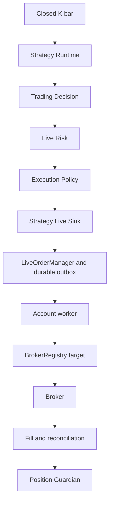
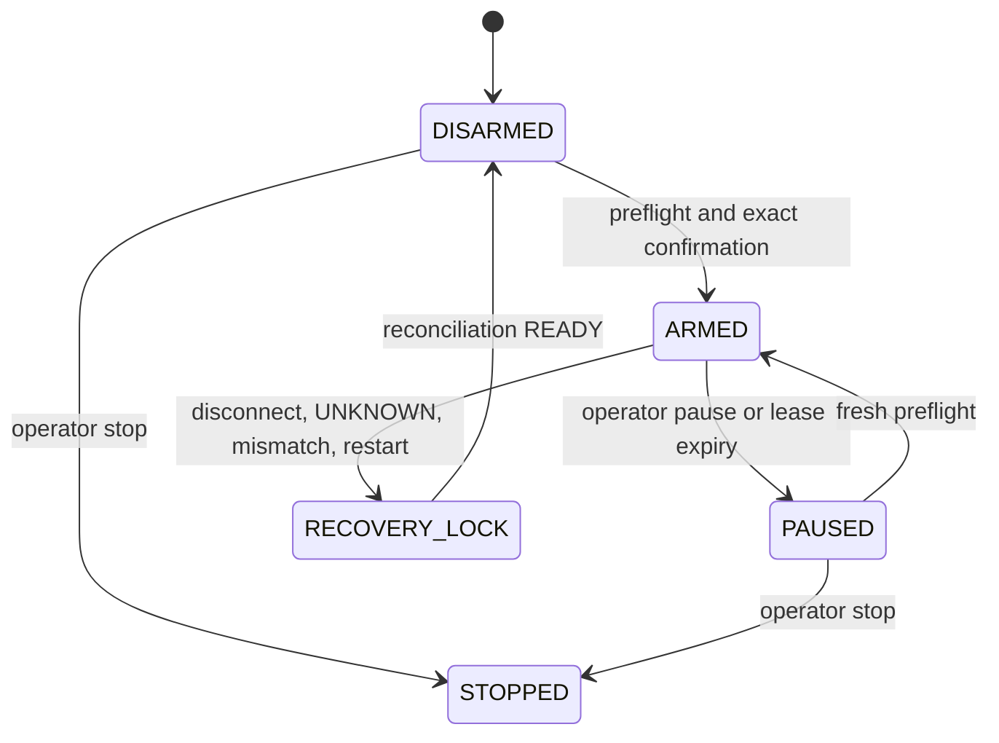

# Strategy Auto Live Runbook

## Safety boundary

Strategy Auto Live is a deliberately narrow extension of the accepted Manual
Live Canary path. It does not introduce another broker adapter or order core.
`LIVE_AUTO_ENABLED=false` is the default. A deploy, process restart, broker
reconnect, or reconciliation never ARM a runtime.

The first release permits exactly one owner, one `BrokerAccountRef`, one
contract, one runtime, and quantity one. There is no pyramiding, broker
fallback, dynamic sizing, smart routing, hedge, or historical signal backfill.

## Architecture

Only `live_auto` decisions may enter `StrategyLiveExecutionSink`. `observe`,
`paper_auto`, `live_shadow`, and manual-paper sources are rejected. A Strategy
Exit creates a Guardian request; it never creates a competing broker order.
Stop Loss, Take Profit, session end, roll, and emergency flatten remain owned by
the Guardian and every resulting order is reduce-only.

## Runtime and ARM lifecycle

Definitions persist immutable broker/account identity, strategy/version
snapshot, symbol/contract, interval, quantity, Live Risk version, and execution
policy version. New definitions start `PAUSED / DISARMED`.

ARM requires `ARM LIVE AUTO - REAL MONEY`, owner/account scope, a short lease,
and a complete server-side preflight: permission and allowlist; Recovery READY;
broker connected; market healthy; fresh execution quote; reconciled position;
healthy Guardian; no UNKNOWN platform or external orders; no unmanaged
position; entry-permitting Kill Switch; available Live Risk config; and recorded
Canary/Production acceptance. ARM and disarm are audit events. The active lease
is process-scoped, so restart invalidates it.

## Entry admission

Before risk evaluation and again immediately before durable reservation the
service verifies ARM, Recovery, broker, market, quote, Guardian, Kill Switch,
position, working entry, and acceptance state. Any failed check rejects the
decision without an outbox row. Client order IDs are deterministic over the
decision, exact target, and policy version. Duplicate decisions therefore reuse
one durable order. A non-flat position or working entry blocks new exposure.

## Pause, stop, disconnect, and restart

- Pause/disarm blocks entry but never removes Guardian protection. Strategy
  exits may continue through the Guardian according to policy.
- Stop ceases new decisions and does not flatten unless the operator explicitly
  selects Flatten.
- Disconnect blocks entry. Reconnect starts reconciliation, does not replay
  missed entry decisions, and does not ARM.
- Restart restores definitions, locks Live Auto, restores Guardian protection
  from broker truth first, and blocks entry until Recovery is READY.
- Pending and UNKNOWN orders are reconciled and never automatically resent.

## UNKNOWN and Kill Switch

Any auto order becoming UNKNOWN immediately removes its ARM, locks the runtime
and account for new exposure, and requires authoritative reconciliation. Retry
count must remain zero.

`HALT_ENTRY` blocks new exposure. `CANCEL_WORKING` cancels platform-owned
exposure-increasing orders. `FLATTEN` has highest priority, delegates reduce-only
liquidation to Guardian, and leaves the runtime locked/disarmed. Operator
control always overrides Strategy Auto.

## Rollout

1. Deploy code with `LIVE_AUTO_ENABLED=false`.
2. Enable capability, verify the UI remains DISARMED, and repeat preflight.
3. With an operator present, ARM one allowlisted broker/account/contract/runtime
   for one lot.
4. Observe Decision → Risk → durable order → broker → fill → Guardian → exit →
   flat. Abort on any duplicate, UNKNOWN retry, mismatch, unprotected position,
   stale-market entry, cross-broker routing, restart ARM, backfill, secret leak,
   or failed operator override.

Rollback is disarm, HALT_ENTRY, CANCEL_WORKING when applicable, and Guardian
FLATTEN only when explicitly chosen. Then set `LIVE_AUTO_ENABLED=false`; do not
disable Guardian while any broker position exists.
